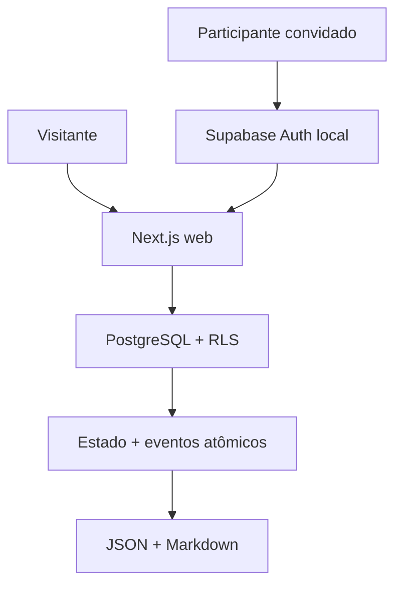

# TECHNICAL-ARCHITECTURE-001 — Gate 1 do MVP habitável

Estado: `IMPLEMENTED LOCALLY / EXTERNAL PUBLICATION NOT AUTHORIZED`

Data: 2026-08-21

Branch: `feat/mvp-001-gate-1`

Base autorizada: `cf8dd97847d1bbb64dae1ade436ee5df2f264c1f`

## Objetivo

Implementar a fundação do Gate 1 sem confundir um corte técnico local com o MVP
completo. A primeira unidade vertical é:

`criar projeto → preservar intenção → publicar → ler → reconstruir → exportar`

Não fazem parte desta arquitetura:

- deploy ou preview externo;
- plano pago ou projeto Supabase remoto;
- smart contract, testnet ou wallet;
- captação, custódia, pagamento ou movimentação financeira;
- oportunidades, propostas e acordos do Gate 2;
- contribuição, evidência e review do Gate 3.

## Stack fixada

| Camada | Escolha | Versão deste corte |
| --- | --- | --- |
| runtime | Node.js LTS | `24` (`24.19.0` no executor) |
| workspace | npm | `11.9.0` no executor |
| aplicação | Next.js App Router | `16.3.2` |
| linguagem | TypeScript estrito | `7.0.2` |
| interface | Tailwind + CSS próprio | `4.3.3` |
| banco e identidade | Supabase/PostgreSQL local | configuração versionada |
| sessão | `@supabase/ssr` | `0.12.4` |
| validação | Zod | `4.4.3` |
| testes web | Vitest + Testing Library | `4.1.11` / `16.3.2` |
| testes de fluxo | Playwright | `1.58.2` |
| testes do banco | pgTAP via Supabase CLI | executados no CI/local com Docker |

As versões estão fixadas no lockfile. O Next.js 16.3.2 permanece restrito a
desenvolvimento local até a publicação do patch de segurança anunciado para
2026-08-26, atualização das dependências e repetição integral dos testes.

## Topologia



### Modo sem banco

Sem variáveis Supabase, a aplicação inicia em `seed-read-only`:

- landing, catálogo, projeto, timeline e exportação funcionam;
- três projetos rotulados demonstram a experiência;
- a rota de escrita explica como ativar o ambiente local;
- nenhum fallback grava estado no navegador ou em arquivo oculto.

### Modo Supabase local

Com Supabase local configurado:

- autenticação usa link por e-mail e Inbucket local;
- apenas e-mails em `pilot_invites` recebem `pilot_membership` ativo;
- criação ocorre por uma função PostgreSQL `SECURITY DEFINER` delimitada;
- leitura pública e leitura de drafts passam por RLS;
- nenhuma chave privilegiada chega ao cliente.

## Estrutura

```text
apps/web/
  app/                 rotas, páginas, handlers e server actions
  components/          componentes de experiência
  lib/domain/          regras e serialização portável
  lib/data/            adapter Supabase + seed read-only
  lib/supabase/        cliente SSR e configuração pública
  tests/               Vitest, Testing Library e Playwright
supabase/
  migrations/          schema, funções, triggers, grants e RLS
  tests/database/      pgTAP positivo e adversarial
  seed.sql             conteúdo rotulado e convite local
scripts/
  check-gate1-contracts.mjs
```

O domínio não depende de componentes React ou do cliente Supabase. A camada de
dados pode trocar o provedor sem alterar o formato de exportação
`cz.project.v1`.

## Modelo de dados implementado

| Objeto | Autoridade e função |
| --- | --- |
| `profiles` | conta humana ligada a `auth.users` |
| `actors` | pessoa, agente, organização ou sistema |
| `actor_memberships` | representação explícita de um ator |
| `pilot_invites` | allowlist de entrada local |
| `pilot_memberships` | autorização ativa de escrita |
| `projects` | estado material do projeto |
| `project_intents` | Registro Original e interpretações versionadas |
| `project_members` | papel contextual no projeto |
| `events` | projeção append-only da trajetória |

Objetos de Gates posteriores não foram antecipados no banco.

## Invariantes executáveis

### Registro Original

- é criado na mesma transação do projeto;
- possui índice parcial que limita um original por projeto;
- `project_intents` é append-only;
- interpretação ocupa outro registro e não substitui o original.

### Estado material e evento

`create_project_atomic`:

1. exige sessão autenticada;
2. exige piloto ativo;
3. resolve o ator humano responsável;
4. valida e cria o estado material;
5. cria original e interpretação;
6. cria o papel `PROJECT_STEWARD`;
7. cria os eventos de criação e, quando pedido, publicação;
8. conclui ou reverte tudo na mesma transação.

`reconcile_project` verifica independentemente:

- existência material;
- exatamente um Registro Original;
- versão material igual à maior versão de evento;
- projeto público acompanhado de evento de publicação.

Essa reconciliação responde diretamente à falha observada em
`AGENT-COUNCIL-MVP-002`: uma cadeia de eventos não é tratada como fonte canônica
autossuficiente.

### Economia

O projeto registra apenas um regime declaratório:

- `VOLUNTARY`;
- `EXCHANGE`;
- `BOUNTY_EXTERNAL`;
- `SPONSORSHIP`;
- `INVESTMENT_INTEREST`.

Nenhum desses estados:

- processa pagamento;
- cria direito econômico;
- promete retorno;
- representa acordo vinculante;
- integra wallet ou contrato.

## Modelo de acesso

### Anônimo

Pode selecionar somente:

- projetos `PUBLIC` com `published_at`;
- ator responsável referenciado pelo projeto público;
- intenções, membros e eventos do projeto público.

### Participante autenticado

Pode também:

- ler seu perfil, representações e membership de piloto;
- ler draft somente quando é steward autorizado;
- chamar `create_project_atomic` quando possui piloto ativo.

Não há `INSERT`, `UPDATE` ou `DELETE` direto concedido a `anon` ou
`authenticated` nas tabelas de domínio.

### Agentes de IA

O schema exige operador humano e rótulo de operador para qualquer ator
`AI_AGENT`. O seed de demonstração evita inventar uma pessoa operadora: usa um
ator de sistema rotulado, não uma falsa identidade humana.

## Threat model do corte

| Ameaça | Controle implementado | Teste/evidência |
| --- | --- | --- |
| escrita pública | grants mínimos + função autenticada | escrita direta deve falhar |
| acesso ao draft alheio | RLS + `can_manage_project` | piloto A não lê draft B |
| criação sem convite | `is_active_pilot` | função retorna `42501` |
| dual-write estado/evento | uma função/uma transação | contagens + rollback |
| sobrescrever intenção | trigger append-only | update retorna `23000` |
| apagar trajetória | trigger append-only | delete retorna `23000` |
| divergência silenciosa | `reconcile_project` | array de achados vazio |
| segredo no cliente | somente URL/chave pública | varredura e `.gitignore` |
| conteúdo sintético parecer real | `source_label` obrigatório | seeds rotulados |
| captação implícita | microcopy + ausência de integrações | health e testes UI |
| framing/MIME/referrer | headers de segurança | build e inspeção de config |

## Exportação e recuperação

Cada projeto público pode ser baixado em:

- JSON com schema `cz.project.v1`;
- Markdown legível sem a aplicação.

A exportação preserva:

- Registro Original;
- interpretação atual;
- ator responsável e tipo;
- estado, visibilidade e versão;
- regime econômico declaratório;
- necessidades e limites;
- timeline com versões materiais;
- avisos de autoridade e economia.

O backup de produção não existe neste Gate porque nenhum projeto remoto foi
autorizado. A recuperação local é definida pelas migrations + seed + export.

## Reprodução local

Pré-requisitos:

- Node 24;
- npm 11;
- Docker ativo;
- Supabase CLI.

Passos:

```bash
npm ci
supabase start
supabase db reset --local
cp .env.example apps/web/.env.local
npm run dev
```

Substitua a chave placeholder pela chave pública exibida por
`supabase status`. Não grave a chave de `service_role`.

Para entrar, use `pilot@celulazero.local` e abra o link no Inbucket local em
`http://127.0.0.1:54324`.

Validação completa:

```bash
npm run lint
npm run typecheck
npm run test
npm run test:contracts
supabase test db
npm run build
npm run test:e2e
```

## Limites e próximos gates

Este corte funda o solo, mas não implementa o ciclo completo. A ordem seguinte
permanece:

1. validar Gate 1 com Docker/pgTAP e navegador em ambiente reproduzível;
2. autorizar e implementar oportunidades, propostas e acordos no Gate 2;
3. implementar contribuição, evidência, review e contestação no Gate 3;
4. discutir qualquer preview, financiamento ou testnet em autorizações próprias.

Nenhum item futuro está autorizado por este documento.
