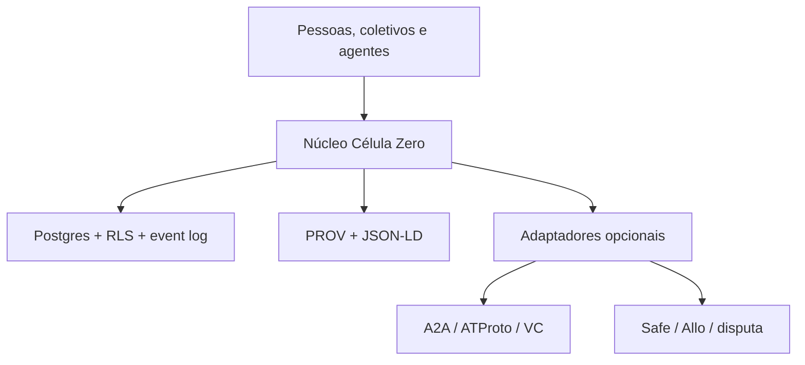

# TECH-LANDSCAPE-WEB3-001 — Tecnologias reutilizáveis para a Célula Zero

- Status: `DOCUMENTARY INVESTIGATION — DRAFT`
- Data de corte: 2026-08-22
- Escopo: arquitetura, padrões e protocolos reutilizáveis
- Fora do escopo: implementação, deploy, smart contract, testnet, movimentação financeira e captação pública
- Relação com `HYPOTHESIS-WEB3-001`: amplia a investigação; não altera seu estado `NOT TESTED`

## 1. Decisão executiva

Vale realizar uma nova investigação de tecnologias, mas não para escolher “uma blockchain” nem para transformar a Célula Zero em uma DAO genérica. A investigação deve decompor o produto em propriedades e reutilizar protocolos diferentes apenas onde cada um já resolve bem uma propriedade necessária.

A recomendação preliminar é uma arquitetura **híbrida, backend-first e protocol-ready**:

1. **PostgreSQL/Supabase** continua como núcleo operacional e fonte de autoridade do MVP: identidade local, organizações, projetos, papéis, autorizações, tarefas, contribuições, evidências, verificações e eventos.
2. **W3C PROV + JSON-LD** define o formato portátil do grafo de proveniência e colaboração.
3. **A2A** pode transportar tarefas e artefatos entre agentes, sem receber autoridade para decidir aceitação, delegação ou pagamento.
4. **DID/VC + OpenID4VCI/OpenID4VP** entram como camada opcional de identidade e credenciais portáteis, depois de um teste fechado de emissão, apresentação, revogação e privacidade.
5. **AT Protocol** merece o principal spike de interoperabilidade social, por separar identidade, repositório pessoal, esquema de dados e visualização. Ele não deve substituir o banco transacional inicialmente.
6. **EAS ou Sign Protocol** podem ser comparados para atestações externas, mas uma atestação nunca será tratada automaticamente como verdade ou verificação.
7. **Safe, Hats e Allo** só entram quando houver papéis e recursos reais que justifiquem execução on-chain. Safe seria a base mais prudente para custódia coletiva futura; Hats, uma possível representação de papéis; Allo, uma infraestrutura de alocação, não de investimento.
8. **Kleros ou UMA** só devem ser testados quando existir um contrato operacional com critérios objetivos de entrega e contestação.
9. **DAO DAO, Aragon, Lens, Juicebox e protocolos DeFi** ficam como referências ou opções posteriores. Adotá-los agora aumentaria superfície técnica, jurídica e econômica antes de existir uma comunidade e uma operação consolidadas.

O resultado não é “Web2 contra Web3”. É um núcleo soberano que funciona sem blockchain, cercado por portas de interoperabilidade substituíveis.

## 2. O que a Célula Zero precisa resolver

A tecnologia deve ser avaliada contra capacidades do produto, não contra narrativas de mercado.

| Capacidade | Pergunta real | Requisito mínimo |
|---|---|---|
| Identidade contextual | Quem ou o que está agindo neste contexto? | Identificadores múltiplos, recuperação, privacidade e vínculo explícito entre ator e controlador |
| Organização/célula | Quem tem autoridade para representar o coletivo? | Papéis contextuais, delegação temporária, revogação e limites de competência |
| Intenção e projeto | O que se pretende fazer e em que estado está? | Estado versionado, responsáveis, escopo, condições e histórico |
| Trabalho | Quem se comprometeu, contribuiu ou entregou? | Tarefas, compromissos, artefatos, dependências e autoria |
| Evidência | O que sustenta uma alegação ou entrega? | Proveniência, integridade, visibilidade, contestação e correção aditiva |
| Verificação | Quem avaliou, por qual método e com que resultado? | Critério explícito, avaliador, evidência examinada, resultado e dissenso |
| Colaboração humano–IA | O que o agente pode ler, propor ou executar? | Capabilities, autorização com escopo, expiração, supervisão e trilha de auditoria |
| Descoberta | Como pessoas, projetos e necessidades se encontram? | Publicação seletiva, busca, filtros, reputação contextual e prevenção de spam |
| Interoperabilidade | Como sair da plataforma sem perder significado? | Exportação assinável, schemas públicos, IDs estáveis e adaptadores |
| Recursos | Como apoiar trabalho sem custódia opaca? | Intenção de financiamento, termos, marcos, aceitação, disputa e recibos |
| Privacidade | O que não deve ser público, permanente ou correlacionável? | RLS, minimização, pseudonímia, retenção, exclusão e disclosure seletivo |
| Governança | Como cada coletivo decide sem perder soberania? | Protocolo local, quórum/contexto configurável, delegação e direito de saída |

### Distinções obrigatórias

- DID não prova que o controlador é uma pessoa real, única ou legítima.
- VC não prova que a afirmação é verdadeira; prova quem a emitiu e que não foi alterada.
- Attestation não equivale a verificação independente.
- Voto não equivale a legitimidade contextual.
- DAO não equivale a comunidade.
- Token não equivale a contribuição, reputação ou direito político.
- Escrow não equivale a investimento regulado nem elimina risco jurídico.
- DeFi não equivale a conformidade financeira.
- Transparência on-chain não equivale a responsabilidade e pode destruir privacidade.

## 3. O que as investigações anteriores já responderam

### 3.1 Supabase/PostgreSQL — `ADOPT AS OPERATIONAL CORE`

O Gate 1 já demonstrou um núcleo local com autenticação, criação e persistência de projeto, eventos append-only, políticas de Row Level Security e testes pgTAP. Isso é mais próximo das necessidades imediatas do backend do que qualquer protocolo DAO completo. A própria documentação do Supabase trata RLS como mecanismo para controle granular de acesso no Postgres.

Conclusão: continuar. A lacuna não é trocar o banco; é completar o domínio operacional acima dele.

### 3.2 W3C PROV + JSON-LD — `ADOPT AS PORTABLE SEMANTICS`

O spike anterior representou o ciclo intenção → compromisso → contribuição → verificação sem perda semântica essencial. O [PROV-DM](https://www.w3.org/TR/prov-dm/) modela entidades, atividades, agentes, derivação, atribuição e delegação; o [JSON-LD 1.1](https://www.w3.org/TR/json-ld11/) fornece serialização compatível com a Web.

Conclusão: adotar o modelo como camada de exportação e intercâmbio, não como banco operacional.

### 3.3 A2A — `ADOPT AS AGENT TRANSPORT, NOT AUTHORITY`

O A2A transporta mensagens, tarefas, artefatos, estados e extensões entre agentes. A [especificação A2A](https://a2a-protocol.org/latest/specification/) não define as regras sociais da Célula Zero: quem pode delegar, quando uma entrega é aceita, qual evidência é suficiente ou quem pode movimentar recursos.

Conclusão: criar futuramente um adaptador. O domínio Célula Zero permanece responsável por capabilities, autorizações, aceitação e auditoria.

### 3.4 Huly — `MAP/OPTIONAL WORKBENCH`

O spike funcional mostrou que Huly pode operar como ambiente de trabalho e colaboração. Porém, o [repositório oficial](https://github.com/hcengineering/platform) apresenta uma plataforma ampla e operacionalmente pesada. Adotá-la como núcleo transferiria dependências e conceitos que não são centrais à Célula Zero.

Conclusão: manter como integração opcional, referência de UX ou workbench conectado por adapter; não como fonte canônica do protocolo.

## 4. Mapa de tecnologias reutilizáveis

Legenda:

- `ADOPT`: incorporar ao desenho atual.
- `MAP`: compatibilizar o modelo e manter um adaptador possível.
- `SPIKE`: executar um teste pequeno antes de decidir.
- `DEFER`: útil depois que existir a necessidade concreta.
- `REJECT FOR MVP`: não usar no MVP de 30 dias.

| Área | Tecnologia/padrão | O que já resolve | Decisão preliminar | Limite principal |
|---|---|---|---|---|
| Backend | PostgreSQL + Supabase | Persistência relacional, transações, Auth, RLS, funções e testes locais | `ADOPT` | Não oferece, sozinho, portabilidade entre organizações |
| Proveniência | W3C PROV | Entidade, atividade, agente, derivação, atribuição e delegação | `ADOPT` | Não define o vocabulário específico de projeto, aceitação e governança |
| Dados portáteis | JSON-LD | Contextos extensíveis e intercâmbio semântico | `ADOPT` | Complexidade se usado em toda consulta operacional |
| Agentes | A2A | Descoberta, tarefas, mensagens, artefatos e extensões | `MAP` | Não define legitimidade, aceite, verificação ou autoridade financeira |
| Identidade | W3C DID Core | Identificador controlável, métodos de verificação e serviços | `SPIKE` | Escolha do DID method, recuperação, correlação e assurance continuam abertas |
| Credenciais | W3C VC 2.0 | Modelo emissor–titular–verificador, proofs e status | `SPIKE` | Credencial é uma declaração verificável, não garantia de verdade |
| Emissão/apresentação | OpenID4VCI + OpenID4VP | Protocolos interoperáveis de emissão e apresentação de credenciais | `SPIKE` | UX, carteira, revogação, selective disclosure e suporte real variam |
| Identidade social | AT Protocol | DID, repositórios pessoais assinados, schemas Lexicon e AppViews | `SPIKE — PRIORITY` | Ecossistema social, não motor de workflow transacional |
| Social on-chain | Lens | Accounts, feeds, graphs, groups, rules, actions e sponsorships | `DEFER` | A própria documentação o posiciona como SocialFi; adiciona chain e economia cedo demais |
| Attestations | Ethereum Attestation Service | Schemas e atestações on-chain/off-chain referenciáveis | `SPIKE` | Attestation não avalia mérito nem resolve privacidade por padrão |
| Attestations | Sign Protocol | Atestações em múltiplas redes e modos on/off-chain | `MAP/SPIKE` | Maior escopo multichain pode superar a necessidade inicial |
| Papéis | Hats Protocol | Papéis, elegibilidade, revogação e árvores de autoridade on-chain | `MAP/SPIKE` | Só faz sentido quando o papel precisa existir fora do backend soberano |
| Conta coletiva | Safe Smart Account | Owners, threshold, assinaturas e execução modular | `DEFER — PREFERRED TREASURY BASE` | Módulos podem contornar a verificação padrão; exigem auditoria e política de risco |
| Governança EVM | Aragon OSx | DAO, permission manager e plugins de governança/ativos/membership | `MAP` | Framework completo antes de haver necessidade de DAO e tesouraria reais |
| Governança Cosmos | DAO DAO | Voting power, proposal modules e core treasury modulares | `MAP` | Escolha de ecossistema/chain e adoção de governança on-chain prematuras |
| Governança off-chain | Snapshot + SafeSnap | Sinalização/votação off-chain com execução condicionada | `DEFER` | Votação não captura por si só consulta, autoridade contextual ou dissenso fundamentado |
| Alocação | Gitcoin Allo | Estratégias programáveis de registro e alocação de recursos | `SPIKE LATER` | É infraestrutura de alocação/grants; não é incubadora, investimento ou compliance |
| Escrow/disputa | Kleros Escrow/Court | Pagamento em escrow e arbitragem baseada em evidências | `SPIKE LATER` | Dependência de jurisdição do protocolo, jurados, taxas, chain e desenho de evidência |
| Oracle/disputa | UMA Optimistic Oracle | Afirmação otimista, janela de disputa e resolução | `SPIKE LATER` | Critérios subjetivos e contextuais podem ser inadequados para oráculo econômico |
| Streaming | Sablier | Vesting e streams temporais de tokens | `DEFER` | Resolve fluxo financeiro, não aceite de trabalho nem legitimidade do pagamento |
| Streaming | Superfluid | Streams contínuos e distribuições programáveis | `DEFER` | Maior complexidade econômica e operacional que o MVP requer |
| Splits recorrentes | Drips | Listas de distribuição e apoio recorrente a dependências | `DEFER` | Bom para open source funding, mas não substitui contratos de projeto e verificação |
| Crowdfunding | Juicebox | Regras programáveis de treasury, emissão e resgate | `REJECT FOR MVP` | Tokenização, captação e risco regulatório/econômico precoces |
| Conteúdo endereçado | IPFS | Identificadores por conteúdo e distribuição | `MAP/SPIKE` | Disponibilidade/pinning, remoção e privacidade não vêm automaticamente |
| Armazenamento permanente | Arweave | Persistência pública de longo prazo | `REJECT FOR SENSITIVE DATA` | Permanência conflita com correção, consentimento, LGPD e saber restrito |
| Account abstraction | ERC-4337/Smart Accounts | Recovery, batching, sponsorship e UX de carteira | `DEFER` | Não é necessário enquanto não houver ação on-chain autorizada |
| Interoperabilidade chain | IBC / CCIP / Hyperlane | Mensageria ou ativos entre redes | `REJECT FOR MVP` | Resolve um problema multichain que a Célula Zero ainda não tem |
| DeFi | Aave/Compound/Uniswap e similares | Crédito colateralizado, pools e swaps | `REJECT FOR MVP` | Não resolvem incubação; introduzem risco financeiro, regulatório e de smart contract |
| Infra de trabalho | Huly | Projetos, tarefas, mensagens e documentos | `MAP/OPTIONAL` | Plataforma extensa e semanticamente diferente do núcleo Célula Zero |
| Canonicalização | Git + assinaturas/hashes | Revisão, versões, autoria e snapshots auditáveis | `ADOPT FOR ARTIFACTS` | Não substitui banco operacional nem oferece controle de acesso fino |

## 5. Shortlist: o que merece atenção real

### 5.1 Identidade e credenciais: DID + VC + OpenID4VC

O [DID Core](https://www.w3.org/TR/did-core/) permite identificar pessoas, organizações, agentes ou conceitos sem exigir blockchain: o registro verificável pode ser ledger, sistema distribuído ou até banco confiável, dependendo do método. O [VC Data Model 2.0](https://www.w3.org/TR/vc-data-model-2.0/) representa declarações verificáveis. [OpenID4VCI](https://openid.net/specs/openid-4-verifiable-credential-issuance-1_0.html) e [OpenID4VP](https://openid.net/specs/openid-4-verifiable-presentations-1_0.html) padronizam emissão e apresentação.

Uso possível na Célula Zero:

- “esta pessoa controla este identificador”;
- “esta organização reconhece este papel por este período”;
- “este agente foi autorizado a executar estas capabilities”;
- “esta pessoa participou, verificou ou concluiu um ciclo específico”.

Uso proibido:

- converter VC em ranking universal;
- publicar pertencimento sensível sem consentimento;
- inferir unicidade humana, confiança ou competência apenas do DID;
- emitir rótulos permanentes ou irremovíveis.

Decisão: testar somente uma credencial de papel revogável e de curto prazo, com dados mínimos e apresentação seletiva. Não escolher uma blockchain no primeiro teste.

### 5.2 Rede social interoperável: AT Protocol antes de Lens

O [AT Protocol](https://atproto.com/guides/overview) separa identidade, hosting, distribuição e aplicação. Seus [repositórios pessoais](https://atproto.com/guides/data-repos) são coleções assinadas e endereçadas por conteúdo; Lexicons permitem schemas de dados específicos.

Isso se aproxima da Célula Zero porque uma intenção, oferta de colaboração ou evidência pública poderia ser publicada no repositório do próprio ator e consumida por múltiplas interfaces. O backend central ainda poderia indexar e moderar, sem se tornar o único lugar onde a declaração existe.

Um possível Lexicon futuro poderia cobrir:

- `cz.project.intent`;
- `cz.contribution.offer`;
- `cz.evidence.claim`;
- `cz.verification.result`;
- `cz.delegation.notice`.

O [Lens Protocol](https://lens.xyz/docs/protocol) também oferece accounts, groups, feeds, graphs, rules e actions, mas se apresenta como infraestrutura SocialFi. É útil como comparação, porém traz uma camada econômica e on-chain desnecessária ao primeiro protocolo social.

Decisão: AT Protocol recebe o spike social prioritário; Lens permanece `DEFER`.

### 5.3 Atestações: EAS ou Sign Protocol, não um contrato próprio

O [Ethereum Attestation Service](https://docs.attest.org/) permite definir schemas e produzir atestações on-chain ou off-chain. O [Sign Protocol](https://docs.sign.global/) oferece proposta semelhante com foco multichain/omnichain.

Uma atestação poderia dizer:

- “o ator A declarou ter produzido o artefato X”;
- “o verificador B avaliou X pelo método M e registrou resultado R”;
- “o coletivo C revogou o papel P na data T”.

Ela não deve dizer implicitamente “X é verdade”. A Célula Zero precisa preservar emissor, método, escopo, evidência, contestação e status epistemológico.

Decisão: comparar EAS off-chain com uma assinatura JSON-LD simples. Só usar on-chain se a verificabilidade por terceiros realmente melhorar.

### 5.4 Autoridade e tesouraria: Safe + papéis explícitos

O [Safe Smart Account](https://docs.safe.global/advanced/smart-account-concepts) implementa owners, threshold e verificação de assinaturas. Modules expandem a execução e Guards verificam transações, mas módulos também podem executar por caminhos diferentes do fluxo padrão; portanto, a extensibilidade é simultaneamente vantagem e risco.

Hats pode representar papéis on-chain. Antes disso, o modelo de papéis deve existir e ser testado no backend:

- titular humano ou agente;
- emissor do papel;
- escopo;
- capabilities;
- validade;
- condições;
- revogador;
- exigência de coassinatura;
- proibição financeira por padrão.

Decisão: nenhum deploy agora. Se surgir tesouraria real, usar Safe auditado como base comparativa, nunca um smart contract de custódia criado do zero.

### 5.5 Governança: aprender com DAO DAO e Aragon sem “virar DAO”

[DAO DAO](https://github.com/DA0-DA0/dao-contracts) separa voting power, proposal modules e core treasury. [Aragon OSx](https://docs.aragon.org/osx-contracts/1.x/core/) separa DAO, permission manager e plugins.

As duas arquiteturas reforçam um princípio útil: poder, proposta, permissão e execução devem ser módulos distintos. Porém, a Célula Zero precisa suportar protocolos locais diferentes, deliberação anterior ao voto, delegações temporárias, dissenso e decisões não financeiras. Importar um framework DAO inteiro antes desse modelo amadurecer inverteria a ordem correta.

Decisão: reutilizar padrões de modularidade e interfaces; adiar runtime de DAO.

### 5.6 Recursos, escrow e disputas

O Allo pode ajudar a registrar projetos e aplicar estratégias de alocação. O [Kleros Escrow](https://docs.kleros.io/products/escrow) é referência para pagamentos condicionados com disputa. O [UMA Optimistic Oracle](https://docs.uma.xyz/protocol-overview/how-does-umas-oracle-work) é referência para afirmações aceitas por padrão e contestáveis.

O fluxo mínimo da Célula Zero deve ser definido antes de qualquer protocolo financeiro:

1. oferta de recurso;
2. termos e partes;
3. marco verificável;
4. evidências esperadas;
5. quem aceita;
6. prazo de contestação;
7. resolução de disputa;
8. liberação ou devolução;
9. recibo e proveniência.

Isso pode ser simulado inteiramente sem dinheiro. Só após o processo funcionar é possível avaliar Allo, Safe, Kleros ou UMA.

## 6. Três arquiteturas possíveis

| Critério | A. Núcleo soberano + provas opcionais | B. Híbrida protocol-ready | C. Protocol-native/on-chain |
|---|---|---|---|
| Núcleo | Postgres/Supabase | Postgres/Supabase + adaptadores | Protocolos sociais, identidade e contratos como núcleo |
| Portabilidade | Exportações PROV/JSON-LD | PROV/JSON-LD + A2A + DID/VC + ATProto seletivo | Alta dentro dos ecossistemas adotados |
| Complexidade em 30 dias | Baixa | Média controlável | Muito alta |
| Risco de lock-in | Médio, mitigado por exportação | Baixo se adaptadores forem substituíveis | Alto entre chain, wallet, indexadores e protocolos |
| Privacidade/correção | Mais simples | Gerenciável por classificação de dados | Difícil quando dados/metadados são públicos ou permanentes |
| UX inicial | Convencional | Convencional com progressão opcional | Carteiras, assinaturas, gas, recovery e múltiplas redes |
| Agentes IA | Autoridade local + A2A posterior | A2A com capability boundary | Permissões on-chain e account abstraction cedo demais |
| Recursos | Registro sem custódia | Integrações futuras com Safe/Allo/Kleros | Tesouraria e contratos desde o início |
| Risco jurídico-financeiro | Baixo | Baixo enquanto testes forem sintéticos | Alto |
| Valor imediato | Backend funcional | Backend funcional e portas reais de saída | Demonstração tecnológica com produto frágil |

### Arquitetura recomendada: B, construída em fases como A

A arquitetura final desejável é híbrida, mas o caminho de implementação deve começar como núcleo soberano. Cada protocolo externo entra atrás de uma interface e só depois de um teste que demonstre valor.

Regras arquiteturais:

- nenhuma integração externa vira fonte única de autoridade;
- todo adapter tem importação, exportação, idempotência, reconciliação e desligamento;
- toda ação de agente declara capability, autorização e evidência;
- dados pessoais ficam off-chain por padrão;
- on-chain recebe, no máximo, compromissos mínimos e revogáveis quando a propriedade justificar;
- nenhuma movimentação financeira depende apenas de output de IA;
- o domínio diferencia declaração, evidência, verificação, aceitação, autorização e execução.

## 7. Backend que deve existir antes do próximo frontend

O próximo incremento funcional não deve ser uma landing page maior. Deve fechar um ciclo operacional no backend.

### Entidades mínimas

- `actors`: pessoa, agente, coletivo ou organização;
- `identities`: identificadores locais/externos e controladores;
- `roles`: papel contextual e período de validade;
- `capabilities`: ações permitidas;
- `delegations`: quem delegou o quê, a quem, até quando e com quais limites;
- `projects`: intenção, estado, visibilidade e responsáveis;
- `work_items`: tarefa, compromisso, condição de aceite e prazo;
- `contributions`: entrega e autoria;
- `evidence`: material, hash, proveniência, acesso e retenção;
- `verifications`: método, avaliador, resultado e contestação;
- `decisions`: proposta, deliberação, regra aplicável e resultado;
- `funding_intents`: oferta ou pedido sem custódia;
- `agreements`: termos e marcos, inicialmente sintéticos;
- `events`: registro append-only reconciliável.

### Primeiro ciclo funcional

1. uma pessoa cria um projeto;
2. publica uma necessidade ou tarefa;
3. outra pessoa ou agente se oferece;
4. o responsável autoriza explicitamente o escopo;
5. o colaborador entrega um artefato com evidência;
6. um verificador aplica critérios registrados;
7. o responsável aceita, rejeita ou contesta;
8. o sistema exporta o ciclo em PROV/JSON-LD;
9. opcionalmente, publica apenas o subconjunto autorizado.

Esse ciclo já torna o produto habitável sem token, DAO ou dinheiro real.

## 8. Spikes futuros propostos — ainda não autorizados

No máximo quatro spikes devem preceder qualquer nova adoção.

### SPIKE-IDENTITY-001 — credencial de papel revogável

- emitir uma credencial mínima de “verificador de projeto”;
- apresentá-la com disclosure mínimo;
- expirar e revogar;
- comprovar que a revogação é observada;
- comparar VC/OpenID4VC com documento assinado localmente.

Critério de avanço: portabilidade real entre dois verificadores sem expor dados desnecessários.

### SPIKE-SOCIAL-001 — intenção portátil em AT Protocol

- definir um Lexicon pequeno para uma intenção pública;
- publicar, editar por nova versão e remover;
- indexar em uma segunda aplicação;
- preservar autoria e histórico sem transformar ATProto em banco do workflow.

Critério de avanço: a mesma intenção é consumida por duas interfaces e continua sob controle do autor.

### SPIKE-AGENT-001 — A2A com capability boundary

- um agente descobre uma tarefa;
- solicita autorização limitada;
- produz artefato;
- não consegue aceitar sua própria entrega nem ampliar permissão;
- toda troca gera eventos reconciliáveis.

Critério de avanço: isolamento de autoridade comprovado por testes negativos.

### SPIKE-ESCROW-001 — acordo sintético sem dinheiro

- criar acordo com marco, evidência e disputa;
- simular liberar, devolver e contestar;
- comparar regras locais com modelos Safe/Allo/Kleros/UMA;
- nenhuma carteira, token ou testnet.

Critério de avanço: o processo resolve três cenários adversariais antes de receber componente financeiro.

## 9. Gates de decisão

Uma tecnologia só passa de investigação para implementação se responder `SIM` a todos os itens aplicáveis:

1. resolve uma propriedade observada em uso real;
2. oferece vantagem sobre Postgres + assinatura + exportação;
3. preserva correção, revogação e dissenso;
4. não exige publicar dados pessoais ou sensíveis;
5. possui caminho de recuperação de chave/conta;
6. pode ser desligada ou substituída por adapter;
7. permite auditoria e teste local;
8. não concede autoridade implícita a agente ou token;
9. tem custos operacionais compreensíveis;
10. não cria obrigação financeira ou regulatória não analisada;
11. possui comportamento definido em falha, disputa e indisponibilidade;
12. melhora o produto para uma pessoa real, não apenas a narrativa técnica.

## 10. O que rejeitar explicitamente no MVP

- chain própria;
- token de governança, investimento ou reputação;
- NFT como identidade obrigatória;
- DAO antes de existir comunidade, patrimônio e processo testado;
- empréstimo, yield, swap ou liquidez DeFi;
- captação pública real;
- carteira obrigatória para primeiro acesso;
- dados pessoais, conhecimento restrito ou evidência corrigível em rede pública;
- agente com chave financeira autônoma;
- reputação global calculada por volume de tokens, likes ou credenciais;
- smart contract criado do zero quando existe componente auditado equivalente;
- arquitetura multichain sem um caso de interoperabilidade entre duas organizações reais.

## 11. Plano de investigação documental

### Fase 1 — Modelo e contratos internos

- fechar vocabulário de ator, papel, capability, delegação, contribuição, evidência, verificação, decisão, acordo e evento;
- definir invariantes e threat model;
- mapear cada entidade para PROV/JSON-LD;
- especificar interfaces dos adapters sem implementar.

### Fase 2 — Dossiês curtos por categoria

- identidade: DID/VC/OpenID4VC;
- rede social: ATProto vs Lens;
- attestation: EAS vs Sign vs assinatura local;
- governança: Safe/Hats/Aragon/DAO DAO;
- recursos: Allo/Safe/Kleros/UMA;
- agentes: A2A e política local de capabilities.

Cada dossiê deve conter: problema, propriedade, alternativa simples, dependências, privacidade, segurança, custo, saída e teste de abandono.

### Fase 3 — Seleção de spikes

Autorizar, em decisão separada, apenas os spikes que atacarem uma lacuna do backend. Um `FAIL` encerra ou reformula a hipótese; não dispara adoção automática de outra tecnologia.

## 12. Conclusão

A Célula Zero não precisa inventar DID, credenciais, feed social, smart account, módulos de governança, streaming ou arbitragem. Precisa inventar — e proteger — apenas sua semântica própria: autoridade contextual, colaboração humano–IA, proveniência, aceitação, dissenso e interoperabilidade entre coletivos soberanos.

O melhor solo fértil não é uma coleção de protocolos. É um núcleo operacional compreensível, exportável e seguro, capaz de incorporar protocolos externos sem ser capturado por nenhum deles.

Portanto:

- backend primeiro;
- semântica antes da chain;
- adapter antes de dependência;
- credencial antes de reputação;
- acordo antes de escrow;
- operação antes de DAO;
- comunidade antes de token;
- evidência antes de confiança.

## 13. Fontes primárias consultadas

- [W3C DID Core](https://www.w3.org/TR/did-core/)
- [W3C Verifiable Credentials Data Model 2.0](https://www.w3.org/TR/vc-data-model-2.0/)
- [OpenID4VCI 1.0](https://openid.net/specs/openid-4-verifiable-credential-issuance-1_0.html)
- [OpenID4VP 1.0](https://openid.net/specs/openid-4-verifiable-presentations-1_0.html)
- [W3C PROV-DM](https://www.w3.org/TR/prov-dm/)
- [W3C JSON-LD 1.1](https://www.w3.org/TR/json-ld11/)
- [A2A Protocol Specification](https://a2a-protocol.org/latest/specification/)
- [AT Protocol Overview](https://atproto.com/guides/overview)
- [AT Protocol Personal Data Repositories](https://atproto.com/guides/data-repos)
- [Lens Protocol](https://lens.xyz/docs/protocol)
- [Ethereum Attestation Service](https://docs.attest.org/)
- [Sign Protocol](https://docs.sign.global/)
- [Safe Smart Account Concepts](https://docs.safe.global/advanced/smart-account-concepts)
- [Aragon OSx Core](https://docs.aragon.org/osx-contracts/1.x/core/)
- [DAO DAO Contracts](https://github.com/DA0-DA0/dao-contracts)
- [Hats Protocol](https://docs.hatsprotocol.xyz/)
- [Gitcoin Allo](https://docs.allo.gitcoin.co/)
- [Kleros Escrow](https://docs.kleros.io/products/escrow)
- [UMA Optimistic Oracle](https://docs.uma.xyz/protocol-overview/how-does-umas-oracle-work)
- [Sablier](https://docs.sablier.com/concepts/what-is-sablier)
- [Superfluid](https://docs.superfluid.finance/docs/concepts/superfluid)
- [Drips](https://docs.drips.network/support-your-dependencies/overview/)
- [Juicebox](https://docs.juicebox.money/dev/v3/learn/overview/)
- [Supabase Row Level Security](https://supabase.com/docs/guides/database/postgres/row-level-security)
- [Huly Platform](https://github.com/hcengineering/platform)
